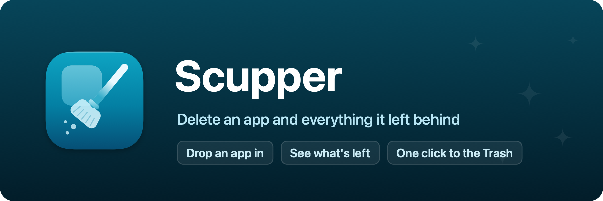

<p align="center">
  
</p>

# Scupper

Remove a Mac app together with the files it leaves behind. Part of [Domus](https://domus-apps.com).

A scupper is the opening in a ship's side or a parapet wall that lets water
drain off the deck instead of pooling. Scupper does that for apps. Dragging
an app to the Trash leaves its settings, caches, and logs pooled in your
Library; drop the app on Scupper instead and they go out with it.

## How it works

Drop an app onto the window or the Dock icon. Scupper reads the app's bundle
identifier and names, then looks through your Library in the places apps
keep things: Application Support, Caches, Preferences, Containers, Group
Containers, Saved Application State, HTTPStorages, WebKit, Logs, crash
reports, analytics records, recent document lists, Launch Agents, Application
Scripts, and background downloads. Vendor folders such as Application
Support/Google are looked into one level down. Folders that collect one small
file per launch, like the analytics records, show as a single row.
Everything it finds is listed with its size, checked, and one click moves it
to the Trash along with the app. Nothing is deleted outright, so the Trash is
your undo. A removed preferences file is also cleared from the preferences
daemon, so it doesn't quietly come back. A running app is asked to quit
first, and whatever it writes on the way out is picked up too.

Two things are deliberately left alone. Documents in iCloud Drive
(`~/Library/Mobile Documents`) belong to you, not to the app, and removing
them would remove them from every device. And when the same app is installed
in a second place, the leftovers are shared, so nothing is checked until you
say so.

Matching is deliberately strict. A folder counts when its name is the bundle
identifier or something under it (`com.vendor.app.helper`), and in the few
places where apps traditionally use their plain name (Application Support,
Caches, Logs) when it equals the app's name. Files of other apps from the
same vendor stay where they are.

Only your own Library is touched. Nothing in `/Library` or the system needs
an administrator, and Scupper never asks for one. A running app is asked to
quit before it moves.

## Development

```sh
./Scripts/dev.sh                          # rebuild-and-relaunch loop
./Scripts/dev.sh --app /Applications/X.app  # open straight into a review
./Scripts/test.sh                         # unit tests
./Scripts/bundle.sh                       # assemble build/Scupper.app
```

Requires macOS 26 or later.

## License

MIT, see [LICENSE](LICENSE). Bundled third-party software and its licenses are listed in [THIRD-PARTY-NOTICES.md](THIRD-PARTY-NOTICES.md).
