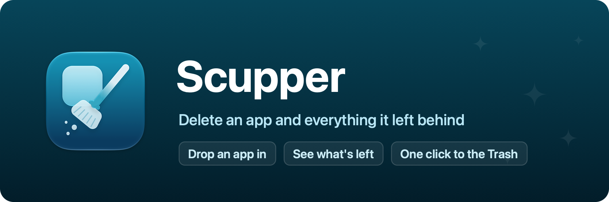

<p align="center">
  
</p>

# Scupper

Remove a Mac app together with the files it leaves behind. Part of [Domus](https://domus-apps.com).

A scupper is the opening in a ship's side or a parapet wall that lets water
drain off the deck instead of pooling. Scupper does that for apps. Dragging
an app to the Trash leaves its settings, caches, and logs pooled in your
Library; drop the app on Scupper instead and they go out with it.

## How it works

Pick an app from the list of installed apps, which you can search (⌘F) and
sort by name or size, or drop one onto the window or the Dock icon. Scupper reads the app's bundle
identifier and names, then looks through your Library in the places apps
keep things: Application Support, Caches, Preferences, Containers, Group
Containers, Saved Application State, HTTPStorages, WebKit, Logs, crash
reports, analytics records, recent document lists, synced preferences, File
Provider data, Launch Agents, Application Scripts, background downloads, and
plug-ins (Quick Look, Spotlight, input methods,
audio units, screen savers, Services). Vendor folders such as Application
Support/Google are looked into one level down. Crash reports are matched by
the app's name, its helper processes included (`Notion Helper`), in your
Library and in the system's diagnostic reports. Outside the Library, it also
looks in the cache folder macOS keeps for each app under `/var/folders`
(graphics shader caches, mostly). Folders that collect one small
file per launch, like the analytics records, show as a single row.
Everything it finds is listed with its size, checked, and one click moves it
to the Trash along with the app. Nothing is deleted outright, so the Trash is
your undo. A removed preferences file is also cleared from the preferences
daemon, so it doesn't quietly come back. A running app is asked to quit
first, and whatever it writes on the way out is picked up too.

Two things are deliberately left alone. Documents in iCloud Drive
(`~/Library/Mobile Documents`) belong to you, not to the app, and removing
them would remove them from every device. And when the same app is installed
in a second place, the leftovers are shared, so nothing is checked until you
say so.

Matching is deliberately strict. A folder counts when its name is the bundle
identifier or something under it (`com.vendor.app.helper`), and in the few
places where apps traditionally use their plain name (Application Support,
Caches, Logs) when it equals the app's name. Files of other apps from the
same vendor stay where they are. A plug-in counts by the identifier inside it,
never by its file name, so a workflow you made yourself in Services stays put.

A plug-in tied to the app only by its developer's signature is listed but
left unchecked, since you may have installed it on its own.

Most of what an app leaves is in your own Library. Installers also put
things in `/Library`: launch daemons, privileged helpers, shared support
files. Those are listed in their own section, and moving them asks for an
administrator password once. The system's diagnostic reports move without
one, since administrators can already write there.

## Development

```sh
./Scripts/dev.sh                          # rebuild-and-relaunch loop
./Scripts/dev.sh --app /Applications/X.app  # open straight into a review
./Scripts/test.sh                         # unit tests
./Scripts/audit.sh                        # what changed across every installed app
./Scripts/audit.sh --accept               # keep this scan as the baseline
./Scripts/bundle.sh                       # assemble build/Scupper.app
```

After changing a matching rule, `audit.sh` scans every installed app (read-only) and diffs what Scupper would offer, with why each item matched, against the last accepted scan. The scans list your own files, so they stay in `audit/`, which git ignores.

Requires macOS 26 or later.

## License

MIT, see [LICENSE](LICENSE). Bundled third-party software and its licenses are listed in [THIRD-PARTY-NOTICES.md](THIRD-PARTY-NOTICES.md).
